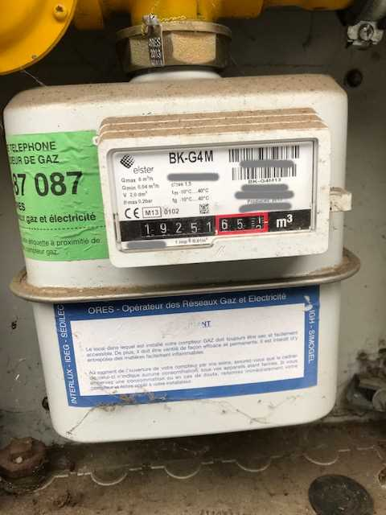
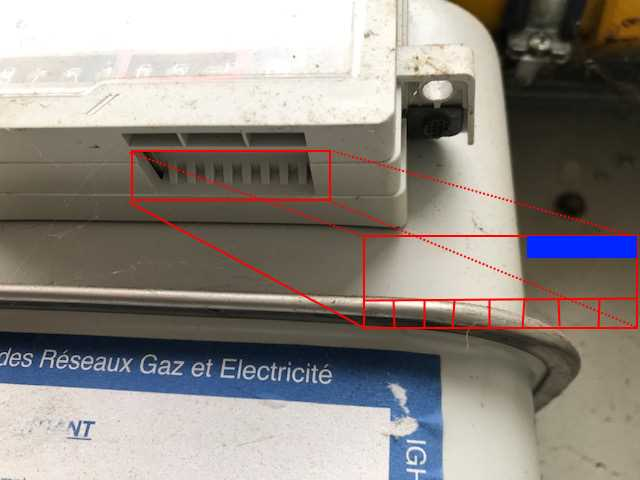
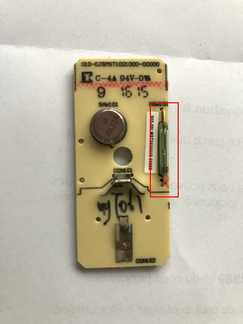
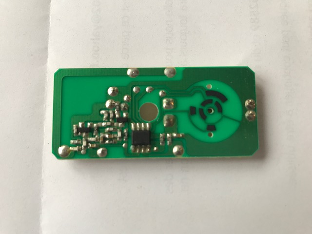
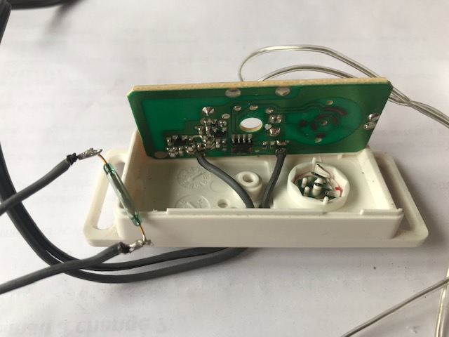
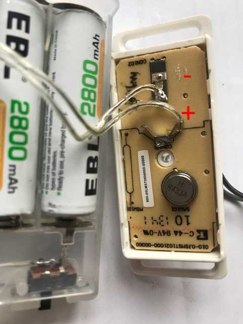
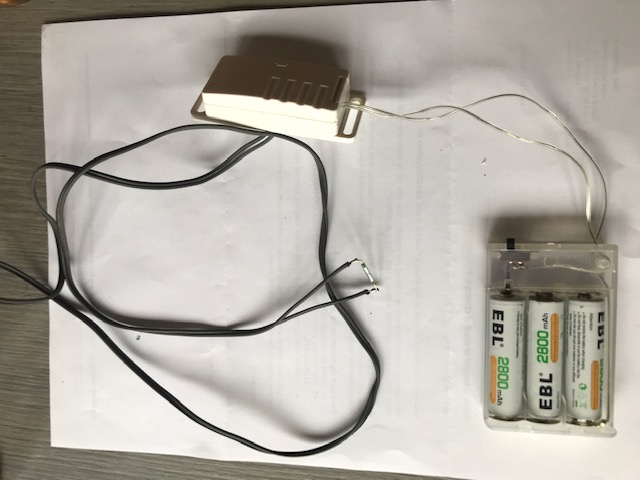

# Gas consumption reading (Elster BK-G4 M meter)
I want to get the gas consumption in Domoticz.

Prerequisites:
* Domoticz
* [RFX433 Mhz Transceivers](http://www.rfxcom.com/epages/78165469.sf/en_GB/?ObjectPath=/Shops/78165469/Categories/Transceivers)
* 433Mhz door opening sensor

## The gas meter
I've a gas meter of type Elster BK-G4:



This counter allow us to measure the consumption with impulsion. The impulsion can be measure under the meter display.



After several tests, i've found that the impulsion is localized in the blue zone (drawn on the previous picture).
We can capture the impulsion with a reed switch.

## Hardware preparation

### Impulsion counter

To measure the impulsion and transfer it to Domoticz I use an older Chacon door opening sensor which works in RF433Mhz. I open the device and localized the reed switch.





I uncouple the reed switch of the board and replace the contact by a two wire cable. At the other extremity of the cable, the reed switch is connected.



### Battery 

The original battery is a 3.2V CR2032. This battery can't survive more than 1-2 months in usage.
To increase the battery life, we can replace the CR2032 by a serie of rechargeable 3XAA 1.2V batteries of 2800mAh. *Put a power voltage regulator could be a good idea.*

*Update: I've removed one battery. The total voltage was effectively too high. With two batteries, there is nearby 2.7V which is enough.*



### The final result



### Connection on meter

I put the reed switch on the gas meter with a piece of [Patafix](https://www.uhu.com/en/product-page/patafix-white/35211). The reed switch must be localized in the blue zone as already mentionned above.
Each impulsion must increased the counter of 0.01 m3.

## Domoticz configuration

1. Add the new device (impulsion counter) in Domoticz. It should be recognize as a sensor switch of type "Lighting 2" by the RFXCOM.
I choose to call it "Statut-ImpulsionCompteurGaz".

2. Add a dummy device of type "Incremental Counter". Edit it and change its type on "Gas". Set the current total comsumption in the "Meter offset" field.
I choose to call it "Compteur gaz".

3. Add a new dzEvent with this code:
```
return {
	on = {
		devices = {
			'Statut-ImpulsionCompteurGaz'
		}
	},
	logging = {
		level = domoticz.LOG_INFO,
		marker = 'template',
	},
	execute = function(domoticz, device)
		domoticz.log('Device ' .. device.name .. ' was changed', domoticz.LOG_INFO)
		
		if(device.active == false) then 
		    domoticz.devices('Compteur gaz').incrementCounter(1)
		end
	end
}
```

That's it. 
Each time the gas meter increase the counter of 0.01 m3. The impulsion counter should switch off/on. This action should throw the event which in turn increase the incremental counter.

