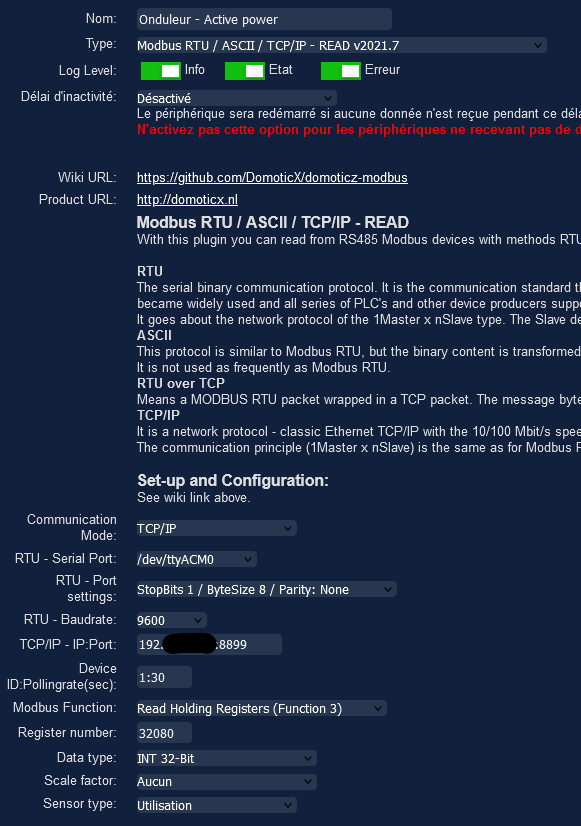
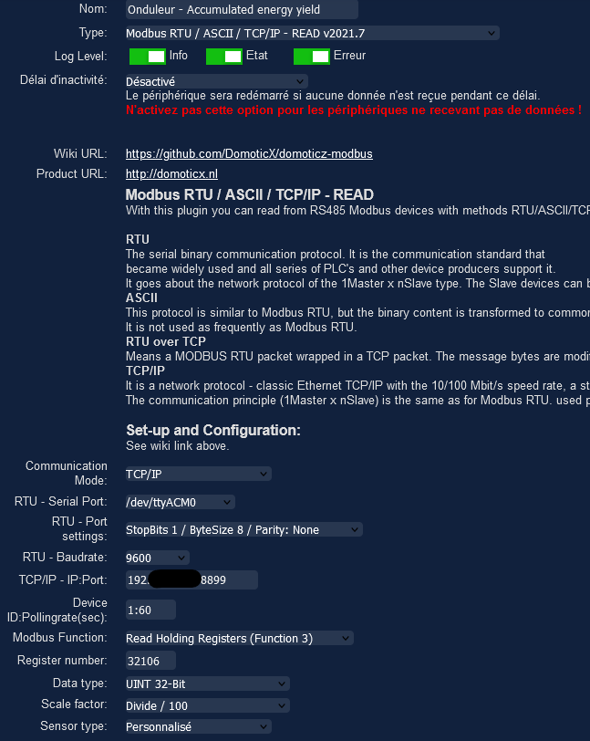
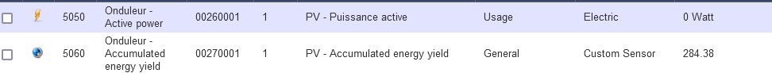
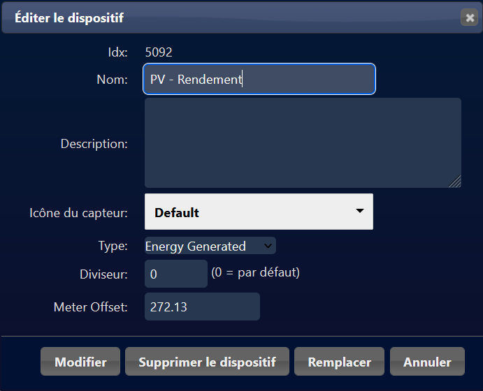
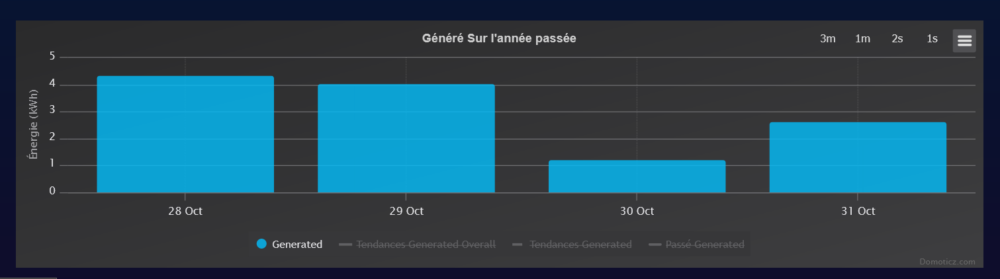
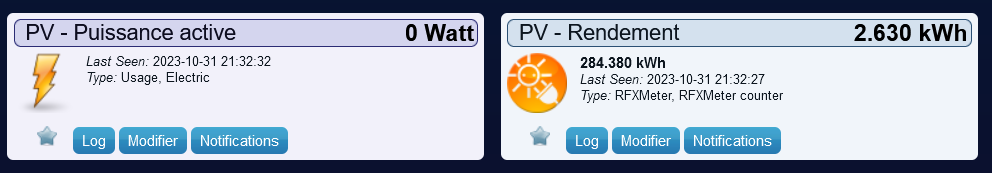

# Huawei SUN2000-(2-6)KTL-L1 inverter in Domoticz
Please find bellow method i've used to connect my huawei SUN2000-4KTL-L1 inverter to domoticz to get back the active power and accumulated energy yield.

## Hardware connection
Firstable, I've check out an [Elfin-EW11 device](https://www.amazon.com.be/s?k=Elfin-EW11&ref=nb_sb_noss) and follow the tutorial available here to connect/configure-it on the inverter: https://github.com/wlcrs/huawei_solar/wiki/Connecting-to-the-inverter#serial-connection-to-a-modbus-rtu-to-tcp-bridge. 


## Domoticz Hardware configuration
Now that your Elfin device is available on your network, you can install the domoticz plugin [Modbus Read/Write Plugins for Domoticz](https://github.com/DomoticX/domoticz-modbus).

After that, for active power, add a new hardware with this configuration (replace TCP/IP by ip of your Elfin device):



Do the same for accumulated energy yield:



You should have two hardware of type "Modbus Read/Write Plugins for Domoticz" at the end.

## Domoticz devices
Two devices should be available in device list. You can rename it at your convenience like me:


### Accumulated energy yield when wifi is over
If you cut off your wifi connection during the night (or in another situation), the accumulated energy yield device will be reset to zero because the plugin send 0 when it cannot get a value back from the Elfin.

To avoid this situation, you can create a Dummy device of type "Counter":


Don't forget to set the type of counter on "Energy generated".

After that, create a new dzEvent event with this code:
```
-- Pcq le plugin modbus n'est pas capable de mettre à jour un device adéquat, je passe par un event pour mettre à jour un compteur.

return {
	on = {
		devices = {
			'PV - Accumulated energy yield'
		}
	},
	--logging = {
	--	level = domoticz.LOG_INFO,
	--	marker = 'template',
	--},
	execute = function(domoticz, device)
		domoticz.log('Device ' .. device.name .. ' was changed', domoticz.LOG_INFO)
		domoticz.log(device.sValue  , domoticz.LOG_INFO)
		
		if(tonumber(device.sValue) > 0) then -- obligé de faire cette condition sinon le compteur est reset pendant la nuit quand le wifi est coupé.
		    domoticz.log((device.sValue * 1000) - 272130  , domoticz.LOG_INFO)
		    domoticz.devices('PV - Rendement').updateCounter((device.sValue * 1000) - 272130)-- pour éviter d'avoir une trop grande variation dans l'historique on fait -272.130 = la valeur du 28/10/2023
		end
	end
}
```

You see that i've set the meter offset of device to 272,13 and i use this value in the event to substract 272,13 from the actual accumulated energy yield received from inverter.
I do this to avoid a spike in the start-up history.
With this fix, i've a serie of average value in the history:


Without fix, i would have 272,13 Kwh on the first day which would minimize the following days.

At the end, i've two devices:


# Resources
Many thanks to writer of this two articles without which I would not have been able to carry out my project:
- https://github.com/wlcrs/huawei_solar/wiki/Connecting-to-the-inverter#serial-connection-to-a-modbus-rtu-to-tcp-bridge
- https://github.com/DomoticX/domoticz-modbus
