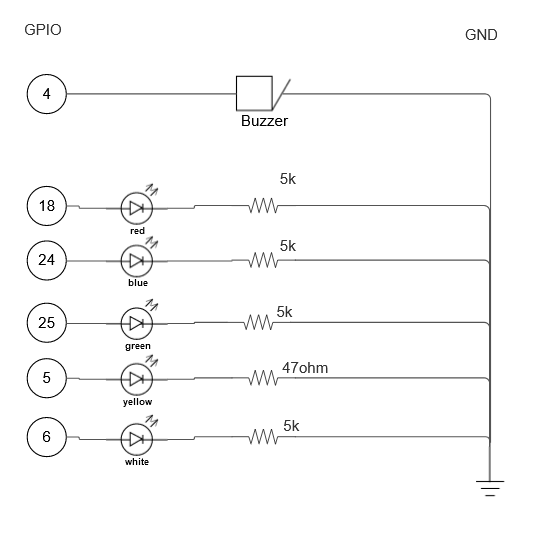
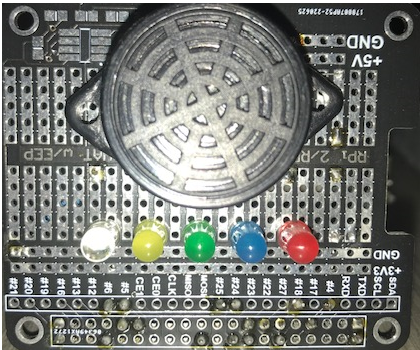
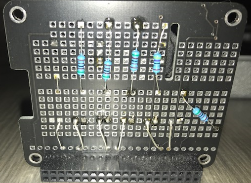
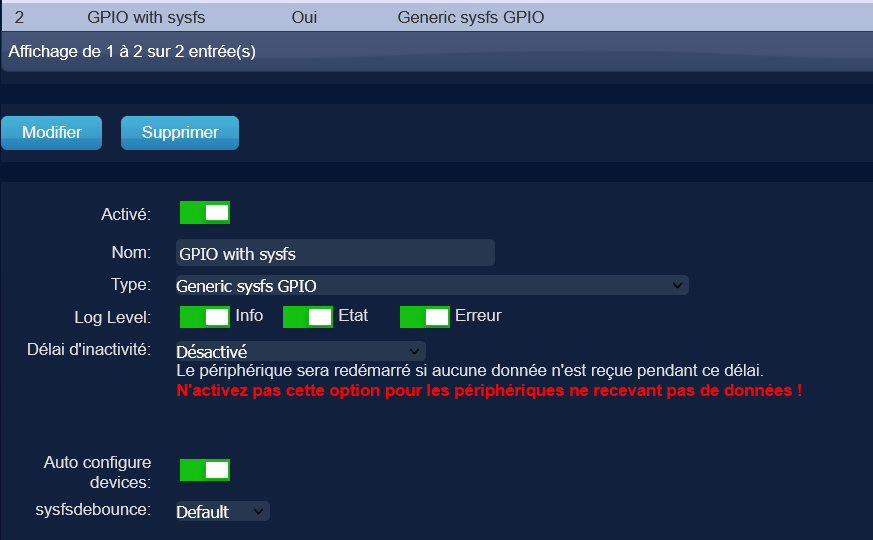
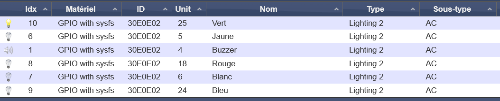
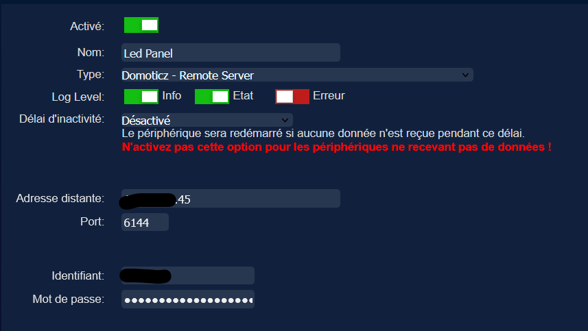
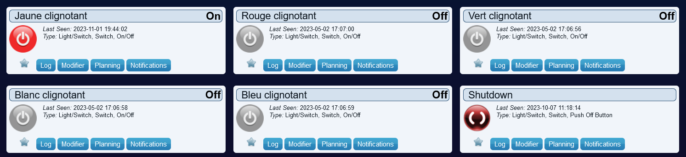

# Led panel alert
To being alerted when a window kept open more than needed during the winter, I've develope a physical led panel which alert me by light up a led and enable a buzzer in some condition.
It could be used in any other situation.

*This component will be controlled from my existing Domoticz.*

## Material
- Raspberry PI 3 A+ (Wifi enabled)
- [5 leds](https://www.amazon.fr/gp/product/B077SDNZHT/ref=ppx_yo_dt_b_asin_title_o08_s00?ie=UTF8&psc=1)
- 1 buzzer
- [PCB Prototype Breadboard Shield Board](https://www.amazon.fr/gp/product/B08C4XLT44/ref=ppx_yo_dt_b_asin_title_o07_s00?ie=UTF8&psc=1)

** And an existing Domoticz installation.

## Mounting

### Electronic diagram on the board


### front of board


### back of board


### connection
At the end, you connect the board to the Rpi via the Gpio.

## Domoticz on Led Panel
### Configure the hardware
To control the led and buzzer, i've install a fresh instance of Domoticz and decide to use the "GPIO with sysfs" hardware to control the GPIO pin where are connected the leds and buzzer.



### Configure the GPIO pin
To allow domoticz to communicate with the GPIO, we have to execute two commands for each of the GPIO to enable:
```
# enable the pin 18
echo 18 > /sys/class/gpio/export
echo out > /sys/class/gpio/gpio18/direction
```
** Do the same for the pin 18, 24, 25, 4, 5, 6

You can found more information here: https://www.domoticz.com/wiki/GPIO

### Control the led and buzzer
Once done, you should find a device for each of enabled GPIO in the device list of Domoticz:



Give it a friendly name and that's it for the led panel.

## Control the led panel from my main Domoticz
Now that i've a led panel, i would like to control it from my main Domoticz server.

To do that, 
* on the led panel Domoticz instance, create a user with the "user" right and give it a password.

* on your Domoticz main server, add a new hardware of type "Domoticz - remote server" by supplying the user information created at the previous step.



* on the led panel Domotice instance, switch on/off at least one time each of the led and buzzer.

* on the Domoticz main server, you should now see a new device (in the device list) for each of the leds and buzzer.

Enjoy it!

## Blink the leds
To blink the led, i've created a dummy switch for each of the leds and an event to enable/disable the blink when the switch is switched on/off.



```
local comAndDevice = {
    { ['com'] = 'Jaune clignotant', ['device'] = "Jaune"},
    { ['com'] = 'Rouge clignotant', ['device'] = "Rouge"},
    { ['com'] = 'Vert clignotant', ['device'] = "Vert"},
    { ['com'] = 'Blanc clignotant', ['device'] = "Blanc"},
    { ['com'] = 'Bleu clignotant', ['device'] = "Bleu"},
    { ['com'] = 'Buzzer clignotant', ['device'] = "Buzzer"},
}

return {
	on = {
		devices = {
	        '*'
	    }
	},
--	logging = {
--		level = domoticz.LOG_INFO,
--		marker = 'template',
--	},
	execute = function(domoticz, triggeredItem)
		local function switchMyDevice(triggeredItem, deviceToSwitch)
		    domoticz.devices(deviceToSwitch).cancelQueuedCommands()
		    triggeredItem.cancelQueuedCommands()
		    
            if(triggeredItem.active)then
                domoticz.log('switch on device: ' .. deviceToSwitch, domoticz.LOG_INFO)
                domoticz.devices(deviceToSwitch).toggleSwitch().forSec(1).repeatAfterSec(1, 3)
                triggeredItem.switchOn().afterSec(8)
            else
                domoticz.log('switch off device: ' .. deviceToSwitch, domoticz.LOG_INFO)
                domoticz.devices(deviceToSwitch).switchOff() -- pour être sur
            end
        end
		
		for i, deviceToCheck in pairs(comAndDevice) do
            local com = deviceToCheck['com']
		    if(com == triggeredItem.name) then
		        local deviceToSwitch = deviceToCheck['device']
		        switchMyDevice(triggeredItem, deviceToSwitch)     
		    end
        end
	end
}
```