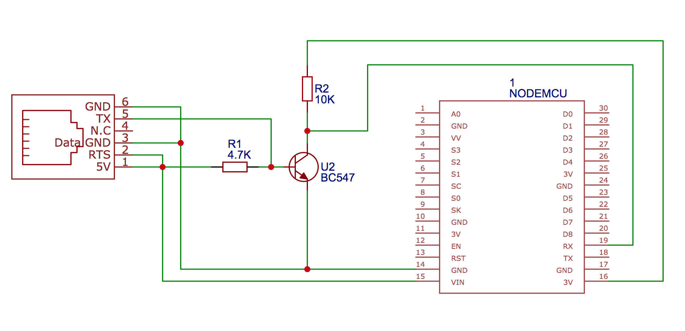
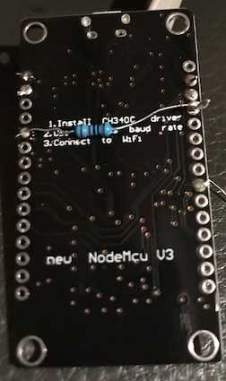
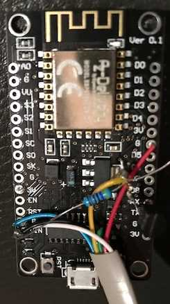
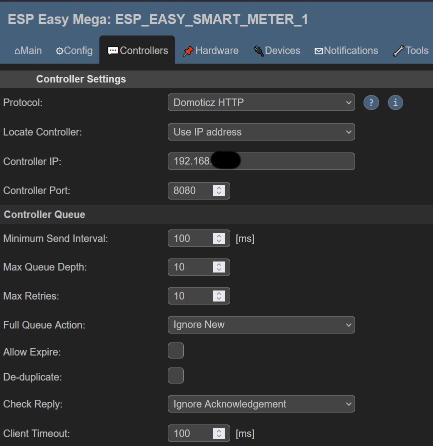
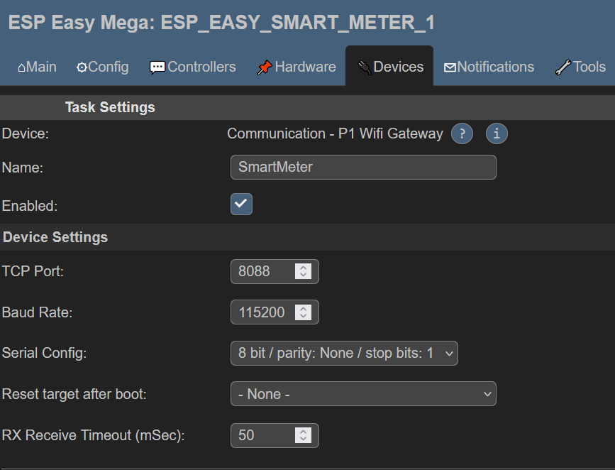
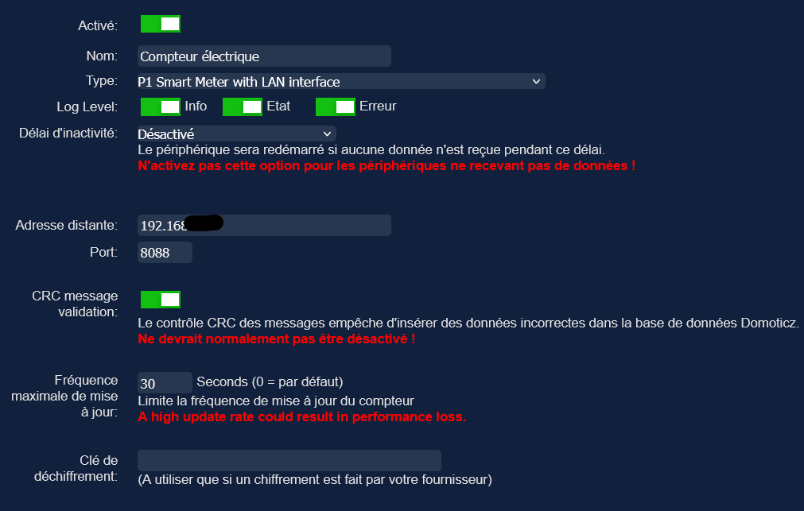
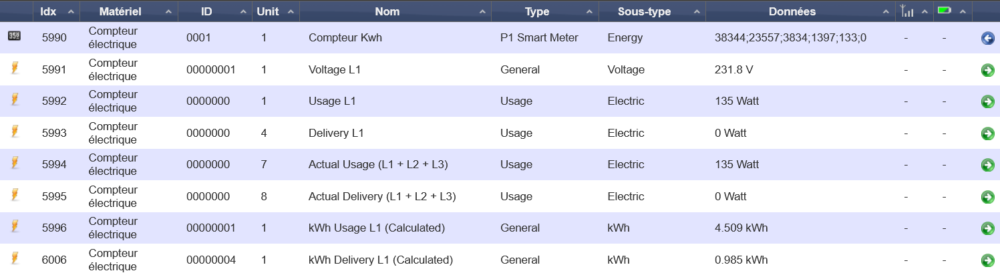

# Power consumption - Sagecom S211 - NodeMcu - Domoticz
Following the solar panel installation, I've asked to my electricity grid operator (Ores in Belium - Wallonie) to install a new smart meter to replace my older one. The meter is a 1-Phase Sagecom S211.

The new meter has a P1 port which can be used to read data from electricity meter.

When installing, don't forget to ask to the operator to activate the client port, otherwise; that's cost you nearby 25€ afterwards.

I will send data to my existing Domoticz server.

## Material
- 1 NodeMCU
- 1 BC548C transistor (used to invert the signal)
- 1 4.7kOhm Resistor
- 1 10kOhm Resistor

** And an existing Domoticz installation.

# Hardware
## Mounting
To build the circuit, I've following the nice post from [psvanstrom](https://github.com/psvanstrom) about smart meter. I've build the circuit using its diagram in paragraphe [Wiring NodeMCU ESP-12](https://github.com/psvanstrom/esphome-p1reader#wiring-nodemcu-esp-12):

Unlike the original diagram, I've used a BC548C transistor because I've one on hand and I don't use RJ12 6P6C port because I've welded the NodeMcu directly to the cable.

## The final result

 

# Software
## NodeMcu preparation

On the nodemcu controller, I've installed a fresh installation of EspEasy. 

On EspEasy server, a Domoticz http controller should be configured:

And you have to add a device of type "Communication - P1 Wifi Gateway":

## Communication tests

To test that the smart meter correctly send data and EspEasy read data without error, you can enable "Debug dev" for "Web log level" property in "Tools\Advanced\Log Settings" menu.
As soon as log is enabled, you can check that you see **"P1 - data send!"** records in "Tools\Log" menu.

## Gets data in Domoticz

In domoticz, add a new hardware of type "P1 smart meter with LAN interface".

Configure the IP of your EspEasy (nodemcu) server in "remote address" and set the port as configured as "TCP port" on "P1 wifi gateway" in EspEasy.

As soon as Domoticz receive data from the smart meter, a lot of new device should be available in "device list":

